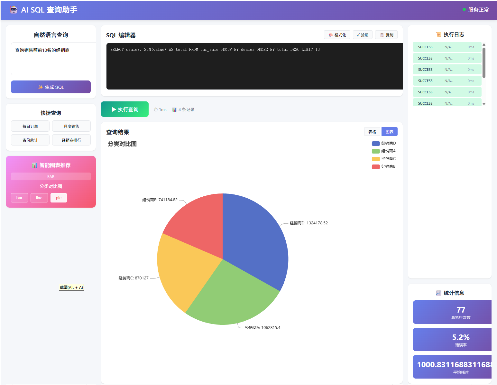

# Spring Boot Demo - AI SQL 查询助手



一个功能完整的 Spring Boot 演示项目，集成了 PostgreSQL 数据库、AI SQL 生成、智能图表推荐和 Vue.js 前端。

## 1. 项目概述

### 1.1 项目背景

spring-boot-demo 是一个集成 PostgreSQL 数据库、Redis 缓存、WebSocket 实时通信和 Vue.js 前端的 Spring Boot 演示项目。其核心功能是通过 AI (Ollama/Llama) 自动生成 SQL 查询语句，并将查询结果以图表形式可视化展示。

### 1.2 核心功能

- **AI SQL 生成**: 用户输入自然语言需求，AI 自动生成 PostgreSQL SQL
- **智能查询执行**: 后端执行 SQL 并返回结果
- **图表可视化**: 根据数据特征自动推荐并生成图表
- **实时交互**: 支持用户编辑生成的 SQL 并重新查询

---

## 2. 技术栈

### 后端
- **框架**: Spring Boot 2.7.10
- **Java 版本**: 1.8
- **数据库**: PostgreSQL
- **连接池**: Druid
- **缓存**: Redis
- **AI**: Ollama (Llama 3.2)
- **工具库**: Hutool、Lombok

### 前端
- **框架**: Vue 3
- **构建工具**: Vite
- **HTTP 客户端**: Axios
- **图表库**: ECharts

---

## 3. 项目结构

```
spring-boot-demo/
├── src/
│   ├── main/
│   │   ├── java/com/example/springbootdemo/
│   │   │   ├── controller/     # REST API 控制器
│   │   │   │   ├── AiController.java           # AI 查询接口
│   │   │   │   └── ExecutionLogController.java  # 执行日志接口
│   │   │   ├── model/          # 数据模型
│   │   │   ├── service/        # 业务逻辑层
│   │   │   │   ├── PromptManager.java           # Prompt 管理
│   │   │   │   ├── SchemaDiscoveryService.java  # 动态 Schema 发现
│   │   │   │   ├── SqlAutoCorrector.java         # SQL 自动修正
│   │   │   │   ├── SqlSecurityValidator.java    # SQL 安全验证
│   │   │   │   ├── ChartRecommendationService.java # 图表推荐
│   │   │   │   ├── QueryCacheService.java        # 查询缓存
│   │   │   │   └── ExecutionLogService.java     # 执行日志
│   │   │   ├── utils/        # 工具类
│   │   │   ├── websocket/    # WebSocket 配置
│   │   │   └── SpringBootDemoApplication.java
│   │   └── resources/
│   │       ├── application.yaml  # 应用配置
│   │       └── db/init.sql       # 数据库初始化脚本
│   └── test/                     # 测试类
├── web/                          # Vue.js 前端项目
│   ├── src/
│   │   ├── components/       # Vue 组件
│   │   │   ├── HelloWorld.vue    # 主页面
│   │   │   └── SqlEditor.vue     # SQL 编辑器
│   │   ├── assets/           # 静态资源
│   │   ├── App.vue           # 根组件
│   │   └── main.js           # 入口文件
│   └── package.json
├── docs/
│   └── AI_SQL_Chart_Design.md # 详细设计文档
├── pom.xml                      # Maven 配置
└── mvnw                         # Maven 包装器
```

---

## 4. 系统架构

### 4.1 整体架构

```
┌─────────────────────────────────────────────────────────────────┐
│                        前端层 (Vue.js)                          │
│  ┌──────────┐  ┌──────────┐  ┌──────────┐  ┌──────────────┐  │
│  │ 用户输入  │→ │ Prompt   │→ │ 图表渲染  │→ │ 错误提示    │  │
│  │ 组件     │  │ 构建器    │  │ 组件     │  │ 组件        │  │
│  └──────────┘  └──────────┘  └──────────┘  └──────────────┘  │
└──────────────────────────┬──────────────────────────────────────┘
                           │
                           ▼
┌─────────────────────────────────────────────────────────────────┐
│                      AI 服务层 (Ollama)                         │
│  ┌──────────────┐  ┌──────────────┐  ┌──────────────────────┐  │
│  │ Prompt 管理器 │→ │ SQL 生成器   │→ │ 多模型支持           │  │
│  │ - Schema     │  │              │  │ - Llama 3.2         │  │
│  │ - 示例       │  │              │  │                      │  │
│  └──────────────┘  └──────────────┘  └──────────────────────┘  │
└──────────────────────────┬──────────────────────────────────────┘
                           │
                           ▼
┌─────────────────────────────────────────────────────────────────┐
│                    安全验证层                                    │
│  ┌──────────────┐  ┌──────────────┐  ┌──────────────────────┐  │
│  │ SQL 语法验证  │→ │ 注入检测     │→ │ 危险关键字过滤       │   │
│  └──────────────┘  └──────────────┘  └──────────────────────┘  │
└──────────────────────────┬──────────────────────────────────────┘
                           │
                           ▼
┌─────────────────────────────────────────────────────────────────┐
│                      数据执行层                                  │
│  ┌──────────────┐  ┌──────────────┐  ┌──────────────────────┐  │
│  │ 智能重试机制  │→ │ 结果缓存     │→ │ 查询优化              │   │
│  └──────────────┘  └──────────────┘  └──────────────────────┘  │
└─────────────────────────────────────────────────────────────────┘
```

### 4.2 数据流设计

```
1. 用户输入自然语言 → Prompt 构建 → AI 生成 SQL
2. SQL 验证 → 语法检查 → 注入检测 → 危险关键字过滤
3. SQL 执行 → 结果缓存 → 响应返回
4. 数据分析 → 图表推荐 → 图表渲染
5. 错误发生 → 错误分类 → 自动修复 → 重试机制
```

---

## 5. 快速开始

### 5.1 环境要求

- JDK 1.8+
- Node.js 14+
- PostgreSQL 12+
- Redis 6+
- Ollama (用于 AI SQL 生成)

### 5.2 后端启动

```bash
# 初始化数据库
psql -U postgres -f src/main/resources/db/init.sql

# 启动 Spring Boot 应用
./mvnw spring-boot:run
```

服务将在 `http://localhost:7878` 启动

### 5.3 前端启动

```bash
cd web
npm install
npm run dev
```

前端将在 `http://localhost:5173` 启动

---

## 6. 核心模块

### 6.1 Prompt 管理器 (PromptManager)

#### 职责
- 管理和构建 AI 提示词
- 包含完整的数据库 Schema 信息
- 提供 SQL 生成规则和示例

#### System Prompt 模板

```
你是 PostgreSQL SQL 专家。

数据库信息：
- 表名: car_sale
- 字段定义:
  * province (省份/地区)
  * date (日期 YYYY-MM-DD HH:MI:SS格式)
  * value (金额/销售额)
  * count (数量)

【强制输出规则】必须严格遵守以下所有规则：
1. 只输出纯 SQL，不要任何前缀、后缀、说明文字、代码块标记
2. 不要包含分号（;）
3. LIMIT 限制最大 100 行
4. 必须使用数据库中实际的列名（如 province、date、value）
5. 禁止使用的操作: DROP, DELETE, TRUNCATE, ALTER, CREATE, INSERT, UPDATE
6. 按日期分组统计时，必须使用 CAST(date AS DATE) 提取纯日期
```

### 6.2 SQL 安全验证器 (SqlSecurityValidator)

#### 验证规则

| 规则类型 | 具体规则 | 处理方式 |
|----------|----------|----------|
| SQL 长度 | 最大 500 字符 | 拒绝 |
| 危险关键字 | DROP, DELETE, TRUNCATE, ALTER, CREATE, INSERT, UPDATE, GRANT, REVOKE | 拒绝 |
| 前缀检查 | 必须以 SELECT 或 WITH 开头 | 拒绝 |
| LIMIT 检查 | 最大 1000 行 | 自动调整 |
| JOIN 数量 | 最多 3 个 JOIN | 警告 |

### 6.3 SQL 自动修正器 (SqlAutoCorrector)

#### 错误类型与修复策略

| 错误类型 | 错误特征 | 修复策略 |
|----------|----------|----------|
| 类型转换错误 | "cannot be cast" | 添加适当的 CAST |
| EXTRACT 错误 | "pg_catalog.extract" | 使用 CAST 包裹日期字段 |
| 不存在函数 | "function does not exist" | 简化函数调用 |
| 语法错误 | "syntax error" | 返回给用户手动修正 |

### 6.4 智能图表推荐器 (ChartRecommendationService)

#### 推荐规则

| 数据特征 | 推荐图表 | 说明 |
|----------|----------|------|
| 时间序列 + 数值 | 折线图/柱状图 | 展示趋势变化 |
| 分类 + 数值 | 柱状图 | 展示分类对比 |
| 单一数值 ≤10行 | 饼图 | 展示占比分布 |
| 数据量 > 100行 | 表格 | 展示详细数据 |

#### 支持的图表类型
- **bar**: 柱状图
- **line**: 折线图
- **pie**: 饼图
- **table**: 数据表格

### 6.5 动态 Schema 发现 (SchemaDiscoveryService)

#### 功能
- 从数据库 information_schema 自动获取表结构
- 缓存 Schema 信息（5分钟 TTL）
- 提供字段类型、描述等信息

---

## 7. API 接口

### 7.1 AI 查询接口

```
POST /ai/query
Content-Type: application/json

Request:
{
  "question": "每天的订单数量是多少"
}

Response:
{
  "success": true,
  "data": {
    "sql": "SELECT CAST(date AS DATE) as date, COUNT(*) FROM car_sale GROUP BY CAST(date AS DATE) LIMIT 100",
    "results": [...],
    "rowCount": 2,
    "executionTimeMs": 125
  },
  "chartRecommendation": {
    "type": "line",
    "title": "时间趋势图",
    "xAxis": "date",
    "yAxis": "count"
  }
}
```

### 7.2 直接执行 SQL

```
POST /ai/execute
Content-Type: application/json

Request:
{
  "sql": "SELECT province, SUM(value) FROM car_sale GROUP BY province LIMIT 100"
}
```

### 7.3 SQL 验证

```
POST /ai/validate
Content-Type: application/json

Request:
{
  "sql": "SELECT * FROM car_sale LIMIT 10"
}

Response:
{
  "valid": true,
  "errors": [],
  "warnings": ["建议添加具体的 SELECT 字段而非 *"]
}
```

### 7.4 执行日志查询

```
GET /logs/recent?limit=10
```

---

## 8. 数据库配置

### 默认配置
- **主机**: 127.0.0.1
- **端口**: 5432
- **数据库**: postgres
- **用户名**: postgres
- **密码**: postgres

### Redis 配置
- **主机**: localhost
- **端口**: 6379
- **数据库**: 0

---

## 9. 安全设计

### 9.1 SQL 注入防护

1. **参数化查询**: 所有用户输入必须参数化
2. **输入过滤**: 过滤特殊字符 `;`, `--`, `/*`, `*/`
3. **权限控制**: 只允许 SELECT 操作
4. **资源限制**: LIMIT 最大 1000 行

### 9.2 审计日志

记录所有 SQL 执行：
- 执行时间
- SQL 内容
- 执行结果
- 状态（SUCCESS/ERROR/VALIDATION_ERROR）

---

## 10. 性能优化

### 10.1 缓存策略

| 缓存内容 | TTL | 说明 |
|----------|-----|------|
| Schema 信息 | 5分钟 | 表结构缓存 |
| 查询结果 | 5分钟 | SQL 查询结果 |
| AI 响应 | 30分钟 | 热门查询 |

### 10.2 查询优化

- 添加 LIMIT 限制
- 使用索引提示
- 分析执行计划
- 慢查询日志

---

## 11. 开发说明

项目采用前后端分离架构：

1. **后端** (Spring Boot) - 负责业务逻辑、数据处理和 AI 交互
2. **前端** (Vue.js) - 负责用户界面、图表渲染和交互

---

## 12. 详细设计

更多详细设计文档请参考：[docs/AI_SQL_Chart_Design.md](docs/AI_SQL_Chart_Design.md)

---

## 许可证

MIT License
